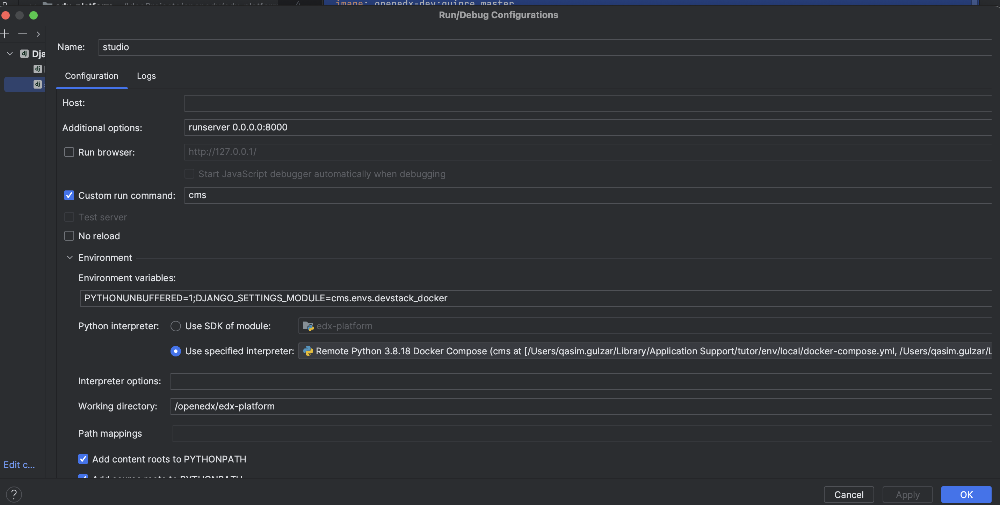

Debug Open edX with IntelliJ IDEA and Add a Python Remote SDK
==============================================================

To debug Open edX with IntelliJ IDEA and add a Python remote SDK, follow these steps:

Install Required Tools
----------------------

Make sure you have Docker and (IntelliJ IDEA or PyCharm) is installed on your system along with the Python and Docker plugin.

Setup OpenEdx with tutor
------------------------

Below are the few steps you need to follow inorder add remote sdk.

#. Find tutor configuration root, ``tutor config printroot``.

#. ``cp "$(tutor config printroot)"/env/apps/openedx/settings/lms/development.py <workspace>/edx-platform/lms/envs/private.py``

#. ``cp "$(tutor config printroot)"/env/apps/openedx/settings/cms/development.py <workspace>/edx-platform/cms/envs/private.py``

#. create ``docker-compose-override.yml`` for you workspace

#. ``tutor mount add <workspace>/edx-platform``

#. ``tutor images build openedx-dev``

#. ``tutor dev launch``

#. remove lms from mfe depends_on section from ``"$(tutor config printroot)"/env/local/docker-compose.yml``

Sample Docker Compose Override
------------------------------
You can use this file to make changes to you docker composed project. e.g. exposing database PORT to connect with IDE's client.

.. code-block:: yml

    version: "3.7"
    x-openedx-service:
      &openedx-service
      image: openedx-dev:quince.master
    services:
      elasticsearch:
        ports:
          - "9200:9200"
          - "9300:9300"
      mongodb:
        ports:
          - "27017:27017"
      mysql:
        ports:
          - "3506:3306"
      lms:
        <<: *openedx-service
        depends_on:
          - mfe
      cms:
        <<: *openedx-service

Add Python Remote SDK
----------------------

#. Go to `File` > `Project Structure` or `CMD+;`
#. Go to `Platform Setting` > Click on `+` button to add new Python SDK
#. Select `Docker Compose` type.
#. Add `docker-compose` files in same order as in screenshot
#. Select service for which you want to setup interpreter.
#. Finally click on OK and you are done with adding SDK

Screenshots
-----------

Run Configurations For OpenEdx
------------------------------

1. Go to `Run` > `Edit Configurations`.
2. Click the `+` button and select `Django Server`.
3. Specify a name for the configuration.
4. Set the `Local host name` and `Port` to match the settings used for the remote debugging.
5. Click `OK` to save the configuration.

Start Debugging
----------------

1. Set breakpoints in your Python code within IntelliJ IDEA.
2. Start the debugging session by selecting the newly created debug configuration and clicking the debug button.
3. IntelliJ IDEA will connect to the remote Python interpreter and pause execution at breakpoints, allowing you to inspect variables and step through the code.

By following these steps, you should be able to set up remote debugging for Open edX in IntelliJ IDEA and add a Python remote SDK for development and debugging purposes.
