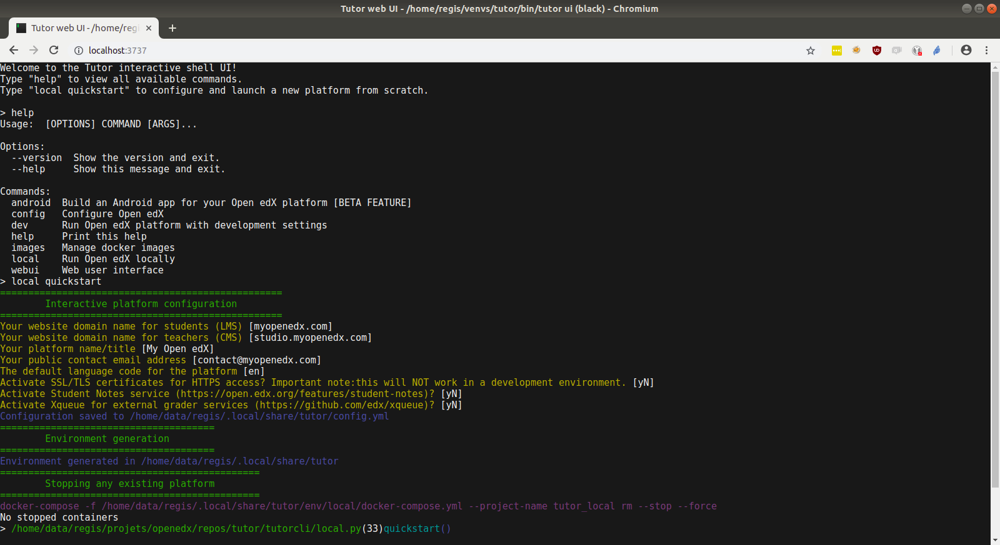

.. _extra:

Extra features
==============

.. _webui:

Web UI
------

Tutor comes with a web user interface (UI) that allows you to administer your Open edX platform remotely. It's especially convenient for remote administration of the platform.

Launching the web UI
~~~~~~~~~~~~~~~~~~~~

::

    tutor webui start

You can then access the interface at http://localhost:3737, or http://youserverurl:3737. 

All ``tutor`` commands can be executed from this web UI: you just don't need to prefix the commands with ``tutor``. For instance, to deploy a local Open edX instance, run::

    local quickstart

instead of ``tutor local quickstart``.

Authentication
~~~~~~~~~~~~~~

**WARNING** Once you launch the web UI, it is accessible by everyone, which means that your Open edX platform is at risk. If you are planning to leave the web UI up for a long time, you should setup a user and password for authentication::

    tutor webui configure

.. _mobile:

Mobile Android application
--------------------------

With Tutor, you can build an Android mobile application for your platform. To build the application in debug mode, run::

    tutor android build debug

The ``.apk`` file will then be available in ``$(tutor config printroot)/data/android``. Transfer it to an Android phone to install the application. You should be able to sign in and view available courses.

Building a custom Android app
~~~~~~~~~~~~~~~~~~~~~~~~~~~~~

The Android app is built from the `official edx-app-android repository <https://github.com/edx/edx-app-android/>`__. To change this repository or the app version, you can simply build a different docker image with::

    tutor images build \
        --build-arg ANDROID_APP_REPOSITORY=https://github.com/mycustomfork/edx-app-android \
        --build-arg ANDROID_APP_VERSION=master

Releasing an Android app
~~~~~~~~~~~~~~~~~~~~~~~~

**Note**: this is an untested feature.

Releasing an Android app on the Play Store requires to build the app in release mode. To do so, edit the ``$TUTOR_ROOT/config.yml`` configuration file and define the following variables::
    
    ANDROID_RELEASE_STORE_PASSWORD
    ANDROID_RELEASE_KEY_PASSWORD
    ANDROID_RELEASE_KEY_ALIAS

Then, place your keystore file in ``$(tutor config printroot)/env/android/app.keystore``. Finally, build the application with::

    tutor android build release

Customising the Android app
~~~~~~~~~~~~~~~~~~~~~~~~~~~

Customising the application, such as the logo or the background image, is currently not supported. If you are interested by this feature, please tell us about it in the Tutor `discussion forums <https://discuss.overhang.io>`_.
