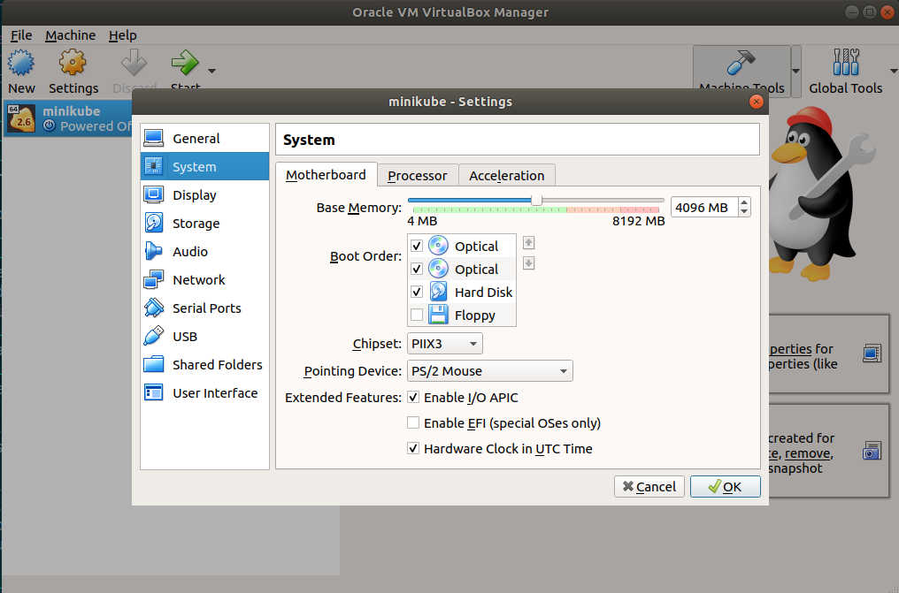
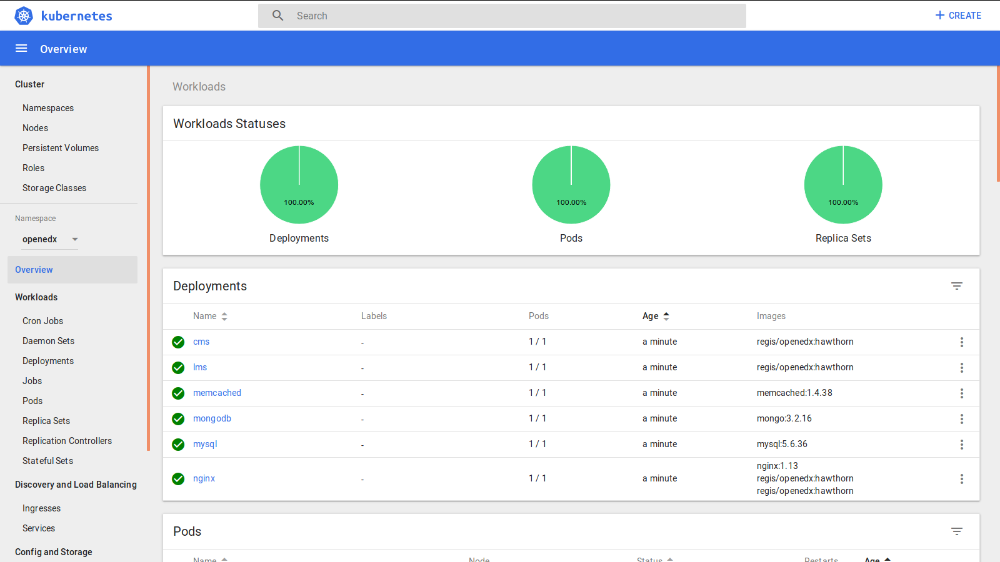

.. _k8s:

Kubernetes deployment
=====================

With the same docker images we created for :ref:`single server deployment <local>` and :ref:`local development <development>`, we can launch an Open edX platform on Kubernetes. Always in 1 click, of course :)

::

           _       _              __            _                  
      __ _| |_ __ | |__   __ _   / _| ___  __ _| |_ _   _ _ __ ___ 
     / _` | | '_ \| '_ \ / _` | | |_ / _ \/ _` | __| | | | '__/ _ \
    | (_| | | |_) | | | | (_| | |  _|  __/ (_| | |_| |_| | | |  __/
     \__,_|_| .__/|_| |_|\__,_| |_|  \___|\__,_|\__|\__,_|_|  \___|
            |_|                                                    

Kubernetes deployment is currently an alpha feature, and we are hard at work to make it 100% reliable 🛠️ If you are interested in deploying Open edX to Kubernetes, please get in touch! Your input will be much appreciated.

Requirements
------------

In the following, we assume you have a working Kubernetes platform. For a start, you can run Kubernetes locally inside a VM with Minikube. Just follow the `official documentation <https://kubernetes.io/docs/setup/minikube/>`_.

Start Minikube::

    minikube start

When minikube starts, it spawns a virtual machine (VM) which you can configure in your VM manager: on most platforms, this is Virtualbox. You should configure your VM to have at least 4Gb RAM; otherwise, database migrations will crash halfway, and that's a nasty issue...

Ingress addon must be installed::

    minikube addons enable ingress

At any point, access a UI to view the state of the platform with::

    minikube dashboard

With Kubernetes, your Open edX platform will not be available at localhost or studio.localhost. Instead, you will have to access your platform with the domain names you specified for the LMS and the CMS. To do so on a local computer, you will need to add the following line to /etc/hosts::

    MINIKUBEIP yourdomain.com studio.yourdomain.com preview.yourdomain.com notes.yourdomain.com

where ``MINIKUBEIP`` should be replaced by the result of the command ``minikube ip``.

Quickstart
----------

Launch the platform on k8s in 1 click::

    tutor k8s quickstart

All Kubernetes resources are associated to the "openedx" namespace. If you don't see anything in the Kubernetes dashboard, you are probably looking at the wrong namespace... 😉

Upgrading
---------

After pulling updates from the Tutor repository, you can apply changes with::

    tutor k8s stop
    tutor k8s start

Accessing the Kubernetes dashboard
----------------------------------

Depending on your Kubernetes provider, you may need to create a dashboard yourself. To do so, run::

	kubectl create -f https://raw.githubusercontent.com/kubernetes/dashboard/master/aio/deploy/recommended/kubernetes-dashboard.yaml

Then, you will have to create an admin user::

    tutor k8s adminuser

Print the admin token required for authentication, and copy its value::

    tutor k8s admintoken

Create a proxy to the Kubernetes API server::

	kubectl proxy

Use the token to log in the dashboard at the following url: http://localhost:8001/api/v1/namespaces/kube-system/services/https:kubernetes-dashboard:/proxy/

Missing features
----------------

For now, the following features from the local deployment are not supported:

- HTTPS certificates
- Xqueue

Kubernetes deployment is under intense development, and these features should be implemented pretty soon. Stay tuned 🤓
