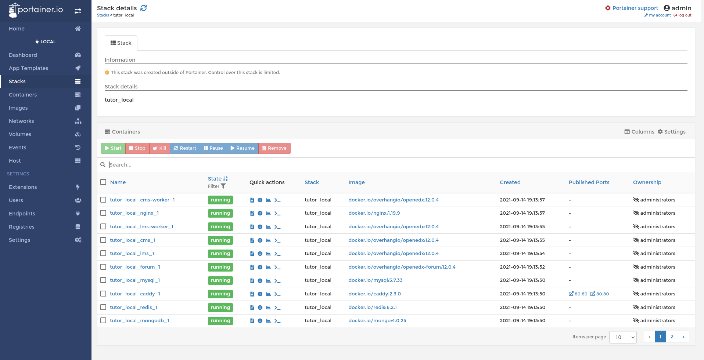

.. _portainer:

Running a Docker container web UI with `Portainer <https://portainer.io/>`__
----------------------------------------------------------------------------

Portainer is a web UI for managing docker containers. It lets you view your entire Open edX platform at a glace. Try it! It's really cool::

    docker run --rm \
        --volume=/var/run/docker.sock:/var/run/docker.sock \
        --volume=/tmp/portainer:/data \
        -p 9000:9000 \
        portainer/portainer-ce:latest --bind=:9000

You can then view the portainer UI at `http://localhost:9000 <http://localhost:9000>`_. You will be asked to define a password for the admin user. Then, select a "Local environment" to work on; hit "Connect" and select the "local" group to view all running containers.

Among many other things, you'll be able to view the logs for each container, which is really useful.
